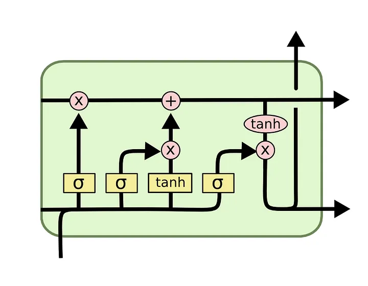
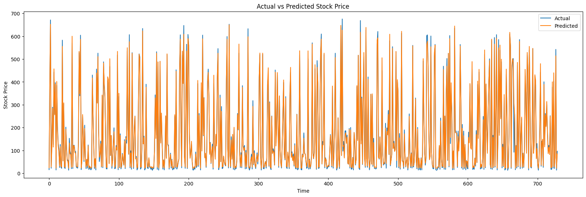

# Stock Market Analysis and Prediction using LSTM

## Overview
This project implements a Long Short-Term Memory (LSTM) neural network to analyze and predict stock market prices. The model uses historical stock data to forecast future stock prices, leveraging deep learning techniques for time series prediction.


## Features
- Time series analysis
- Data preprocessing and normalization
- LSTM model implementation using PyTorch
- Stock price prediction
- Performance visualization and metrics
- Model evaluation with MSE and R-squared metrics

## Installation
1. Clone the repository:
```bash
git clone https://github.com/drisskhattabi6/Stock-Market-Analysis-and-Prediction-using-LSTM.git
cd Stock-Market-Analysis-and-Prediction-using-LSTM
```

## Model Architecture
The LSTM model consists of:
- Input layer (2 features)
- 3 LSTM layers with 150 hidden units
- Dropout layers for regularization
- Fully connected output layer



## Results
- Mean Squared Error (MSE) : 195.6144
- R-squared (R²) score : 0.9941
- Visualization of actual vs predicted prices :

